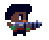

<h1 align="center">
 Rampage-in-Dolores
</h1>

Este título tratará de un motor 2D perteneciente al género Acción y Aventura. La historia comienza con una raza alienígena que toma control del planeta tierra, asesinando a la mayoría de los habitantes del planeta al quedar algunas personas vivas, tratan de salvar su planeta y sobrevivir por su cuenta. Este videojuego se enfoca en Dolores Hidalgo Cuna de la Independencia, cuando la invasión ocurrió, CJ un estudiante de la UTNG quedo atrapado en su universidad, por lo tanto, tiene que enfrentarse a los alienígenas abriéndose paso por la universidad y las calles de Dolores buscando más supervivientes.

 

# Tabla de Contenido
1. [Planeación](#planeación)
2. [Docuemntación](#documentación)
3. [Personajes](#personajes)
4. [Objetos](#objetos)
5. [Niveles](#niveles)
6. [Guion](#guion)
7. [Tecnologias](#tecnologias)
8. [Cursos](#cursos)

## Planeación

Para el manejo de este proyecto se utilizó la herramienta de gestión Trello, con esta herramienta se logró tener un control en las fechas de entrega, asignación, seguimiento y cierre de tareas, así como el manejo de los Sprins
Dentro de esta planeación se manejaron 4 Sprins  (Diseño, Desarrollo, Pruebas con Correcciones y Gráficos y Sonido) cada uno de ellos con sus distintas tareas especificadas en la planeación en la herramienta.
 Si deseas acceder a la planeación puedes dar clic sobre la imagen.

## Documentación
| Nombre              | Rampage in Dolores                       |
|---------------------|------------------------------------------|
| 
Género 
          | 
Acción y Aventura
|
|
Público Objetivo
  | 
18 a 35 años
     |
|
Desarrolladores
| Jessy Javier Araiza Cervantes   
y
  Jorge Alejandro Rico Arvizu |
|
Tecnologías 
| 
Unity
            |

## Personajes
| Información del Personajes  | Imagen                        |
|-----------------------------|-------------------------------|
| **Nombre:** CJ   **Edad:** 22 años    **Rol:** Protagonista      |  |
| **Nombre:** Soldado N1   **Edad:** Desconocida    **Rol:** Enemigo nivel 01    |  |
| **Nombre:** Soldado N2   **Edad:** Desconocida    **Rol:** Enemigo nivel 02    |  |
| **Nombre:** Jefe   **Edad:** Desconocida    **Rol:** Enemigo Final    |  |

## Objetos
|Nombre | Detalle| Imagen |
|-|-|-| 
|Corazon | Lo podrás encontrar en algunas partes del mapa y te permite recuperar salud | |

## Niveles
|Nombre| ¿Donde? |Imagen|
|-|-|-|
|Nivel 01|El nivel se desempeña en la UTNG al quedar atrapado en ella.| |
|Nivel 02|Se desempeña en la avenida norte, pasando por las tiendas mas famosas como, la flamita, farmacia guadalajara, tienda de empeño entre otras.| |
|Nivel 03|El nivel 03 y final se lleva a cabo en la parroquia de Dolores Hidalgo contra el lider de los infernals| |

## Guion
|Ecena | Descripcion |
|- |-|
|1|**El inicio:**   El juego comienza con una vista del personaje escondido en la Universidad.   En un descuido uno de los alienigenas deja su arma, CJ la roba y ahi empieza su lucha en la Universidad|
|2|**Personaje principal:**   "Todo ha cambiado. Dolores está en ruinas, y la humanidad está atrapada. Pero no me rendiré. Tengo que sobrevivir."|
|3|**Objetivo de la mision:**   "Debes de abrirte paso hasta salir de la univeridad"|
|4|**La salida:**   "Despues de una larga batalla logra derrotar a algunos de los infernals y logra salir de la universidad" (Final de Nivel 01)|
|5|**Camino largo:**   "Atraviesa las calles de Dolores Hidalo para buscar mas supervivientes"|
|6|**Personaje principal:**   "Dolores antes estaba lleno de vida... "|
|7|**Recta final:**   "Un largo y dificil camino pero he logrado llegar al centro de dolores" (Fin del Nivel 02)|
|8|**Lider de los Infernals:**   "Tu resistencia es inútil, humano. La Tierra será nuestra."|
|9|**Victoria:**   "El jugador logra derrotar al lider de los infernals"|
|10|**Personaje principal:**   "Dolores es nuestro una vez más."|

## Tecnologias

|Nombre| Tecnologias  | Versiones            |Imagen|Descarga|
|-----------------------------|----------|-|-|-|
|Motor |Unity|2022.3.12f1||[Descarga](https://unity.com/es/download)|
|Editor de Texto|Visual Estudio Code|1.84.2||[Descarga](https://code.visualstudio.com/)|

## Cursos

Se tomaron los cursos necesarios para lograr obtener los conosimientos necesarios para la realizacion de este videojuego de nombre Rampage in Dolores 
|Nombre| Tecnologias  | Link        |Imagen|
|-----------------------------|----------|-|-|
|Introduccion a Unity para videojuegos 2D |Unity|[Curso 2D](https://www.domestika.org/es/courses/716-introduccion-a-unity-para-videojuegos-2d/course) ||
|Tutorial COMPLETO Unity 2D desde Cero|Unity|[Curso 2D](https://www.youtube.com/watch?v=GbmRt0wydQU&pp=ygUOY3Vyc28gMmQgdW5pdHk%3D)||
